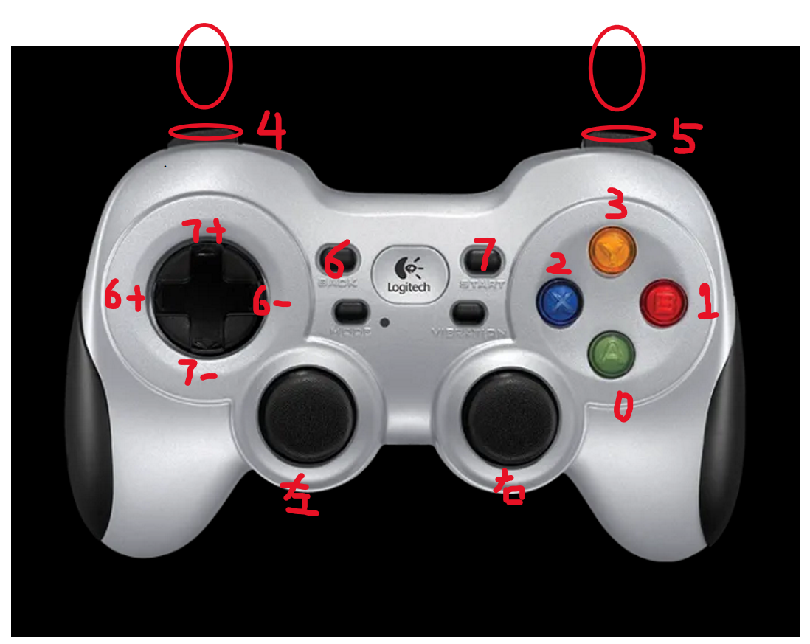

# cdroid_ros2_deploy

## Overview
This repository contains the setup and instructions for deploying a bipedal robot using ROS 2.

## Follow the instruction in docs, Install OnnxRuntime

## Installation
To install the necessary ROS 2 packages, run the following commands:
   ```bash
sudo apt install ros-humble-gazebo-ros2-control 
sudo apt install ros-humble-gazebo-ros-pkgs
sudo apt install ros-humble-joy
sudo apt install ros-humble-joy-teleop
sudo apt install ros-humble-joint-state-broadcaster
sudo apt install ros-humble-joint-state-publisher
sudo apt install ros-humble-controller-interface
sudo apt install ros-humble-control*
sudo apt-get install ros-humble-xacro
sudo apt install ros-humble-domain-bridge
   ```
## Build the Project

After installing the required packages, build the project using:
```

colcon build --symlink-install 

sudo su
source install/setup.bash
```
## Running on Hardware
   ```bash
   ros2 launch rl_controllers rl_control_real.launch.py
   ros2 topic echo /data_analysis/imu_euler_xyz
```

## JoyStick Controls


### Control Instructions
1. **Press 7**: Robot enters the first position control (Start Control).
2. **Hold 4 and press 0**: Robot enters the second position control (LIE2STAND).
3. **Press 2**: Program enters reinforcement learning control; the robot can maintain balance (STAND2WALK).
4. **Hold 5 and press 0**:  Swing arm while walking (Default2SwingArm).
5. **During stepping**: Use the left joystick to control the robot's forward/backward and left/right movement speed.
6. **During stepping**: Use the right joystick to control the robot's rotation speed.
7. **Press 3**: Robot can re-enter the second position control (WALK2STAND).
8. **To re-enter reinforcement learning mode**: Press 2 again (STAND2WALK).
9. **Emergency Stop**: Press 7 to immediately stop the robot (ShutDown Control).
9. **Switch On / Off(上/下使能)**: Press 4 + 3
10. **Control On / Off(申请/关闭控制权)**: Press 5 + 3 